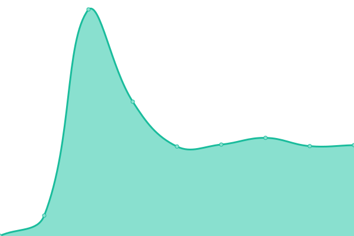
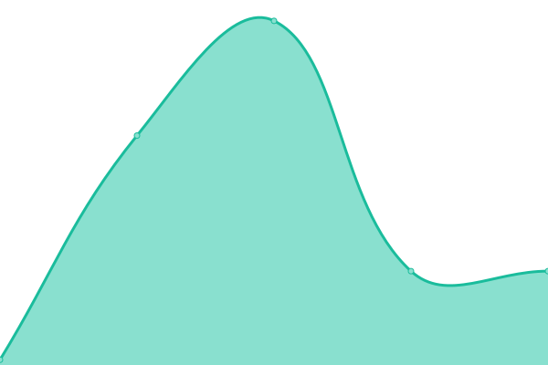
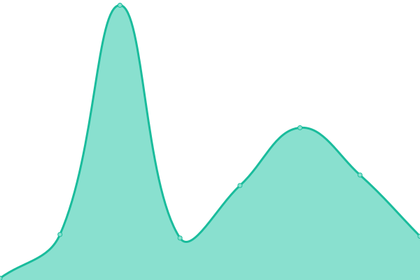

# [📈 Live Status](https://status.cornelltilde.com): <!--live status--> **🟧 Partial outage**

This repository contains the open-source uptime monitor and status page for [Tilde@Cornell](https://status.cornelltilde.com), powered by [Upptime](https://github.com/upptime/upptime).

<!--start: status pages-->
<!-- This summary is generated by Upptime (https://github.com/upptime/upptime) -->
<!-- Do not edit this manually, your changes will be overwritten -->
<!-- prettier-ignore -->
| URL | Status | History | Response Time | Uptime |
| --- | ------ | ------- | ------------- | ------ |
|  [tilde@Cornell Site](https://cornelltilde.com/) | 🟥 Down | [tilde-cornell-site.yml](https://github.com/tilde-Cornell/CornellTildeUptime/commits/HEAD/history/tilde-cornell-site.yml) | 

 420ms
     
 | 

<a href="https://status.cornelltilde.com/history/tilde-cornell-site">99.99%</a>
    

|  [tilde@Cornell Email](mail.cornelltilde.com) | 🟩 Up | [tilde-cornell-email.yml](https://github.com/tilde-Cornell/CornellTildeUptime/commits/HEAD/history/tilde-cornell-email.yml) | 

 114ms
     
 | 

<a href="https://status.cornelltilde.com/history/tilde-cornell-email">100.00%</a>
    

|  [tilde@Cornell Forgejo](https://code.cornelltilde.com) | 🟩 Up | [tilde-cornell-forgejo.yml](https://github.com/tilde-Cornell/CornellTildeUptime/commits/HEAD/history/tilde-cornell-forgejo.yml) | 

 175ms
     
 | 

<a href="https://status.cornelltilde.com/history/tilde-cornell-forgejo">100.00%</a>
    

|  [tilde@Cornell Forgejo SSH](code.cornelltilde.com) | 🟩 Up | [tilde-cornell-forgejo-ssh.yml](https://github.com/tilde-Cornell/CornellTildeUptime/commits/HEAD/history/tilde-cornell-forgejo-ssh.yml) | 

 32ms
     
 | 

<a href="https://status.cornelltilde.com/history/tilde-cornell-forgejo-ssh">91.81%</a>
    

|  [tilde@Cornell SSO service](https://sso.cornelltilde.com) | 🟩 Up | [tilde-cornell-sso-service.yml](https://github.com/tilde-Cornell/CornellTildeUptime/commits/HEAD/history/tilde-cornell-sso-service.yml) | 

 484ms
     
 | 

<a href="https://status.cornelltilde.com/history/tilde-cornell-sso-service">89.47%</a>
    

|  [tilde@Cornell Dev Server](https://dev.cornelltilde.com) | 🟩 Up | [tilde-cornell-dev-server.yml](https://github.com/tilde-Cornell/CornellTildeUptime/commits/HEAD/history/tilde-cornell-dev-server.yml) | 

 457ms
     
 | 

<a href="https://status.cornelltilde.com/history/tilde-cornell-dev-server">63.67%</a>
    

<!--end: status pages-->

[**Visit our status website →**](https://status.cornelltilde.com)

## 📄 License

- Powered by: [Upptime](https://github.com/upptime/upptime)
- Code: [MIT](./LICENSE) © [Anand Chowdhary](https://anandchowdhary.com), supported by [Pabio](https://pabio.com)
- Data in the `./history` directory: [Open Database License](https://opendatacommons.org/licenses/odbl/1-0/)
