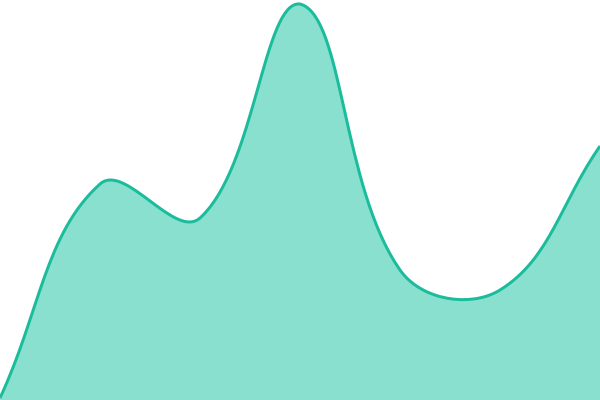
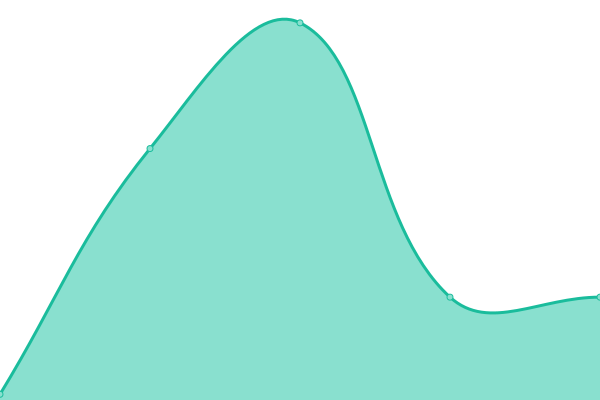

# [📈 Live Status](https://status.cornelltilde.com): <!--live status--> **🟧 Partial outage**

This repository contains the open-source uptime monitor and status page for [Tilde@Cornell](https://status.cornelltilde.com), powered by [Upptime](https://github.com/upptime/upptime).

<!--start: status pages-->
<!-- This summary is generated by Upptime (https://github.com/upptime/upptime) -->
<!-- Do not edit this manually, your changes will be overwritten -->
<!-- prettier-ignore -->
| URL | Status | History | Response Time | Uptime |
| --- | ------ | ------- | ------------- | ------ |
|  [tilde@Cornell Site](https://cornelltilde.com/) | 🟥 Down | [tilde-cornell-site.yml](https://github.com/tilde-Cornell/CornellTildeUptime/commits/HEAD/history/tilde-cornell-site.yml) | 

 107ms
     
 | 

<a href="https://status.cornelltilde.com/history/tilde-cornell-site">93.83%</a>
    

|  [tilde@Cornell Email UI](https://mail.cornelltilde.com) | 🟥 Down | [tilde-cornell-email-ui.yml](https://github.com/tilde-Cornell/CornellTildeUptime/commits/HEAD/history/tilde-cornell-email-ui.yml) | 

 152ms
     
 | 

<a href="https://status.cornelltilde.com/history/tilde-cornell-email-ui">93.84%</a>
    

|  [tilde@Cornell SMTPS](mail.cornelltilde.com) | 🟩 Up | [tilde-cornell-smtps.yml](https://github.com/tilde-Cornell/CornellTildeUptime/commits/HEAD/history/tilde-cornell-smtps.yml) | 

 11ms
     
 | 

<a href="https://status.cornelltilde.com/history/tilde-cornell-smtps">100.00%</a>
    

|  [tilde@Cornell STARTTLS](mail.cornelltilde.com) | 🟩 Up | [tilde-cornell-starttls.yml](https://github.com/tilde-Cornell/CornellTildeUptime/commits/HEAD/history/tilde-cornell-starttls.yml) | 

 18ms
     
 | 

<a href="https://status.cornelltilde.com/history/tilde-cornell-starttls">100.00%</a>
    

|  [tilde@Cornell IMAPS](mail.cornelltilde.com) | 🟩 Up | [tilde-cornell-imaps.yml](https://github.com/tilde-Cornell/CornellTildeUptime/commits/HEAD/history/tilde-cornell-imaps.yml) | 

 15ms
     
 | 

<a href="https://status.cornelltilde.com/history/tilde-cornell-imaps">100.00%</a>
    

|  [tilde@Cornell Forgejo](https://code.cornelltilde.com) | 🟩 Up | [tilde-cornell-forgejo.yml](https://github.com/tilde-Cornell/CornellTildeUptime/commits/HEAD/history/tilde-cornell-forgejo.yml) | 

 485ms
     
 | 

<a href="https://status.cornelltilde.com/history/tilde-cornell-forgejo">100.00%</a>
    

|  [tilde@Cornell Forgejo SSH](code.cornelltilde.com) | 🟩 Up | [tilde-cornell-forgejo-ssh.yml](https://github.com/tilde-Cornell/CornellTildeUptime/commits/HEAD/history/tilde-cornell-forgejo-ssh.yml) | 

 0ms
     
 | 

<a href="https://status.cornelltilde.com/history/tilde-cornell-forgejo-ssh">100.00%</a>
    

|  [tilde@Cornell SSO service](https://sso.cornelltilde.com) | 🟩 Up | [tilde-cornell-sso-service.yml](https://github.com/tilde-Cornell/CornellTildeUptime/commits/HEAD/history/tilde-cornell-sso-service.yml) | 

 462ms
     
 | 

<a href="https://status.cornelltilde.com/history/tilde-cornell-sso-service">100.00%</a>
    

|  [tilde@Cornell Dev Server](https://dev.cornelltilde.com) | 🟥 Down | [tilde-cornell-dev-server.yml](https://github.com/tilde-Cornell/CornellTildeUptime/commits/HEAD/history/tilde-cornell-dev-server.yml) | 

 115ms
     
 | 

<a href="https://status.cornelltilde.com/history/tilde-cornell-dev-server">93.86%</a>
    

<!--end: status pages-->

[**Visit our status website →**](https://status.cornelltilde.com)

## 📄 License

- Powered by: [Upptime](https://github.com/upptime/upptime)
- Code: [MIT](./LICENSE) © [Anand Chowdhary](https://anandchowdhary.com), supported by [Pabio](https://pabio.com)
- Data in the `./history` directory: [Open Database License](https://opendatacommons.org/licenses/odbl/1-0/)
